# Elasticsearch + Spring Boot

A complete CRUD and advanced search application built with **Spring Boot 4.1.1** and **Elasticsearch 9.4.5**, featuring JWT authentication, full-text search, fuzzy matching, wildcard queries, geospatial queries, aggregations, and more.


---

## Table of Contents

- [Architecture Overview](#architecture-overview)
  - [Step 1: Client Sends Request](#step-1-client-sends-request)
  - [Step 2: Security Layer Validates](#step-2-security-layer-validates)
  - [Step 3: Controller Routes](#step-3-controller-routes)
  - [Step 4: Service Processes](#step-4-service-processes)
  - [Step 5: Repository Queries Elasticsearch](#step-5-repository-queries-elasticsearch)
- [Tech Stack](#tech-stack)
- [Prerequisites](#prerequisites)
- [Getting Started](#getting-started)
- [Project Structure](#project-structure)
- [Authentication Flow](#authentication-flow)
  - [Step 1: Register](#step-1-register)
  - [Step 2: Login](#step-2-login)
  - [Step 3: Use JWT Token](#step-3-use-jwt-token)
- [API Endpoints](#api-endpoints)
- [Elasticsearch Features](#elasticsearch-features)
- [Entity Relationship](#entity-relationship)
- [Configuration](#configuration)
- [License](#license)

---

## Architecture Overview

### Step 1: Client Sends Request

Every request enters through the client and hits the Spring Boot application on port `8080`.

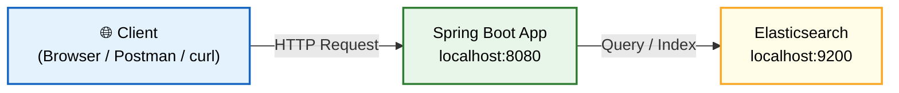

---

### Step 2: Security Layer Validates

Before reaching any controller, the request passes through Spring Security. The JWT filter checks if a valid token is attached.

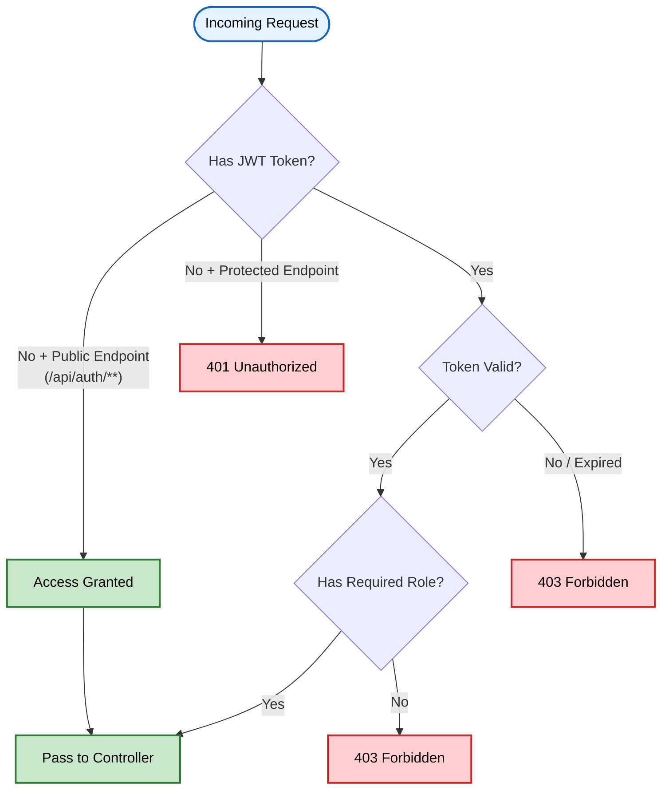

---

### Step 3: Controller Routes

The request is routed to the appropriate controller based on the URL path. Each domain (product, article, log, location) has its own controllers split by responsibility.

```mermaid
flowchart TD
    FILTER["Security Filter passes request"] --> ROUTE{"URL Path?"}

    ROUTE -->|"/api/auth/*"| AUTH_CTRL["AuthController\n(Register / Login)"]
    ROUTE -->|"/api/users/*"| USER_CTRL["UserController"]
    ROUTE -->|"/api/products"| PROD_CTRL["ProductController\n(CRUD)"]
    ROUTE -->|"/api/products/search/*"| PROD_SEARCH["ProductSearchController\n(Queries)"]
    ROUTE -->|"/api/products/admin/*"| PROD_ADMIN["ProductAdminController\n(Index Mgmt)"]
    ROUTE -->|"/api/articles"| ART_CTRL["ArticleController\n(CRUD)"]
    ROUTE -->|"/api/articles/search/*"| ART_SEARCH["ArticleSearchController"]
    ROUTE -->|"/api/logs"| LOG_CTRL["LogController\n(CRUD)"]
    ROUTE -->|"/api/logs/search/*"| LOG_SEARCH["LogSearchController"]
    ROUTE -->|"/api/locations"| LOC_CTRL["LocationController\n(CRUD)"]
    ROUTE -->|"/api/locations/search/*"| LOC_SEARCH["LocationSearchController\n(Geo Queries)"]

    style FILTER fill:#e3f2fd,stroke:#1565c0,stroke-width:2px,color:#000
    style AUTH_CTRL fill:#e8f5e9,stroke:#2e7d32,stroke-width:2px,color:#000
    style USER_CTRL fill:#e8f5e9,stroke:#2e7d32,stroke-width:2px,color:#000
    style PROD_CTRL fill:#e8f5e9,stroke:#2e7d32,stroke-width:2px,color:#000
    style PROD_SEARCH fill:#e8f5e9,stroke:#2e7d32,stroke-width:2px,color:#000
    style PROD_ADMIN fill:#e8f5e9,stroke:#2e7d32,stroke-width:2px,color:#000
    style ART_CTRL fill:#e8f5e9,stroke:#2e7d32,stroke-width:2px,color:#000
    style ART_SEARCH fill:#e8f5e9,stroke:#2e7d32,stroke-width:2px,color:#000
    style LOG_CTRL fill:#e8f5e9,stroke:#2e7d32,stroke-width:2px,color:#000
    style LOG_SEARCH fill:#e8f5e9,stroke:#2e7d32,stroke-width:2px,color:#000
    style LOC_CTRL fill:#e8f5e9,stroke:#2e7d32,stroke-width:2px,color:#000
    style LOC_SEARCH fill:#e8f5e9,stroke:#2e7d32,stroke-width:2px,color:#000
```

---

### Step 4: Service Processes

Controllers delegate to services. Each domain has a **CRUD service** and a separate **Search service** for advanced queries.

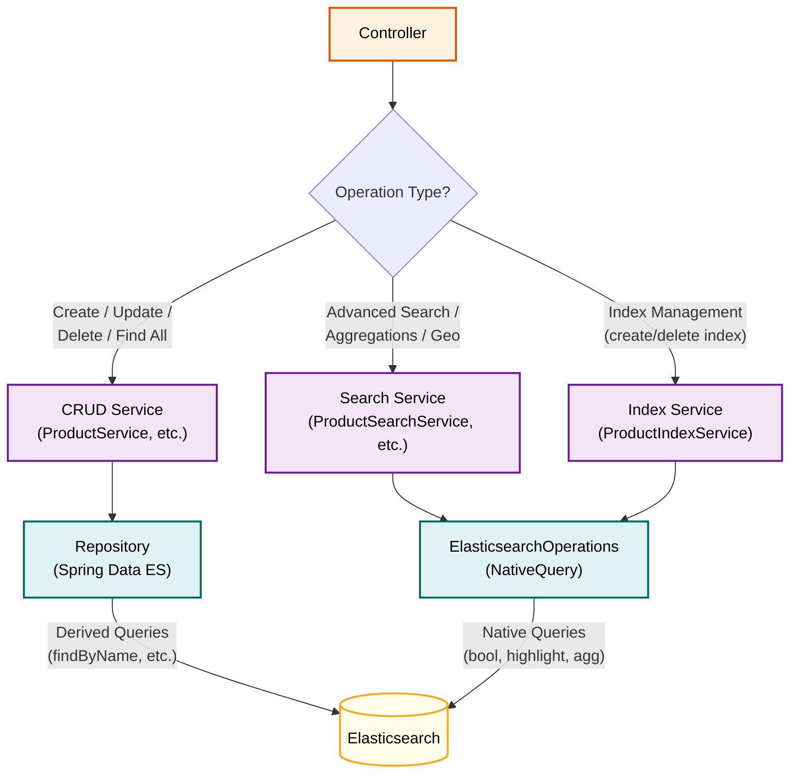

---

### Step 5: Repository Queries Elasticsearch

Two ways to query Elasticsearch:

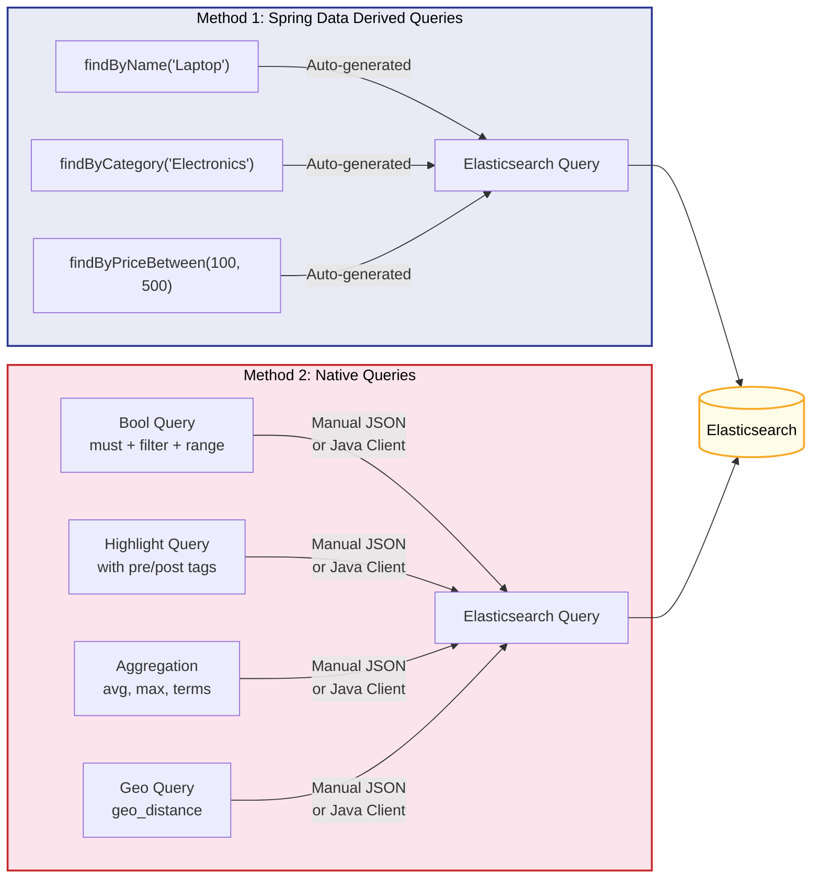

---

## Tech Stack

| Technology | Version | Purpose |
|------------|---------|---------|
| Java | 25 | Programming language |
| Spring Boot | 4.1.1 | Application framework |
| Spring Data Elasticsearch | 6.1.1 | ES data access |
| Elasticsearch Java Client | 9.4.5 | Native ES queries |
| Spring Security | 6.x | Authentication & authorization |
| JJWT | 0.12.6 | JWT token generation |
| Lombok | Latest | Boilerplate reduction |
| Elasticsearch | 9.4.5 | Search engine |
| Docker | Latest | Container runtime |

---

## Prerequisites

- **Java 25+** (JDK)
- **Maven 3.9+**
- **Docker & Docker Compose** (for Elasticsearch)

---

## Getting Started

### 1. Start Elasticsearch

```bash
docker-compose up -d
```

This starts a single-node Elasticsearch 9.4.5 instance on port `9200`.

### 2. Build the Project

```bash
./mvnw clean install
```

### 3. Run the Application

```bash
./mvnw spring-boot:run
```

The app starts on **http://localhost:8080**.

### 4. Quick Test

```bash
# Register
curl -X POST http://localhost:8080/api/auth/register \
  -H "Content-Type: application/json" \
  -d '{"username":"admin","email":"admin@test.com","password":"password123","role":"ADMIN"}'

# Login
curl -X POST http://localhost:8080/api/auth/login \
  -H "Content-Type: application/json" \
  -d '{"username":"admin","password":"password123"}'
```

---

## Project Structure

```
src/main/java/com/sawmik/elastic_search/
├── config/                          # Configuration classes
│   ├── AppConfig.java               # CORS & JWT config properties
│   ├── GlobalExceptionHandler.java  # Centralized exception handling
│   └── SecurityConfig.java          # Spring Security configuration
│
├── controller/                      # REST API controllers
│   ├── AuthController.java          # Register & Login
│   ├── UserController.java          # User management
│   ├── product/
│   │   ├── ProductController.java       # CRUD operations
│   │   ├── ProductSearchController.java # Search & queries
│   │   └── ProductAdminController.java  # Index management
│   ├── article/
│   │   ├── ArticleController.java       # CRUD operations
│   │   └── ArticleSearchController.java # Search & queries
│   ├── log/
│   │   ├── LogController.java           # CRUD operations
│   │   └── LogSearchController.java     # Search & aggregations
│   └── location/
│       ├── LocationController.java      # CRUD operations
│       └── LocationSearchController.java# Geo queries
│
├── dto/                             # Data Transfer Objects
│   ├── auth/    (AuthResponse, LoginRequest, RegisterRequest)
│   ├── user/    (UserResponse)
│   ├── product/ (ProductRequest, ReviewRequest)
│   └── location/(LocationRequest, Coordinates)
│
├── entity/                          # Elasticsearch document entities
│   ├── Product.java
│   ├── Article.java
│   ├── LogEntry.java
│   ├── Location.java
│   ├── User.java
│   └── product/Review.java
│
├── repository/                      # Spring Data Elasticsearch repositories
│   ├── ProductRepository.java
│   ├── ArticleRepository.java
│   ├── LogEntryRepository.java
│   ├── LocationRepository.java
│   └── UserRepository.java
│
├── security/                        # Security components
│   ├── CustomUserDetailsService.java
│   ├── JwtAuthenticationFilter.java
│   └── JwtTokenProvider.java
│
├── service/                         # Business logic
│   ├── AuthService.java
│   ├── product/ (ProductService, ProductSearchService, ProductIndexService)
│   ├── article/ (ArticleService, ArticleSearchService)
│   ├── log/     (LogService, LogSearchService)
│   └── location/(LocationService, LocationSearchService)
│
└── ElasticSearchApplication.java    # Main entry point
```

---

## Authentication Flow

### Step 1: Register

Create a new account. The password is hashed with BCrypt before storing.

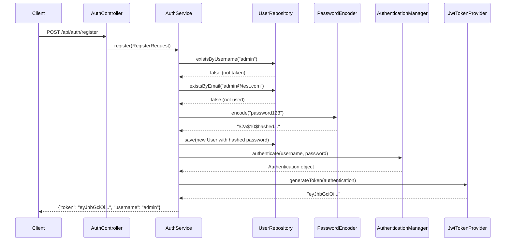

---

### Step 2: Login

Authenticate with existing credentials and receive a JWT token.

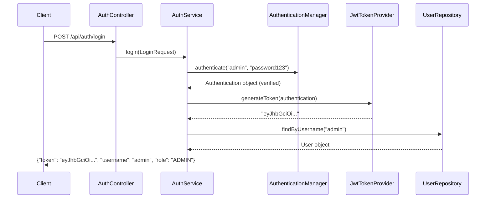

---

### Step 3: Use JWT Token

Attach the token to subsequent requests. The filter validates it on every call.

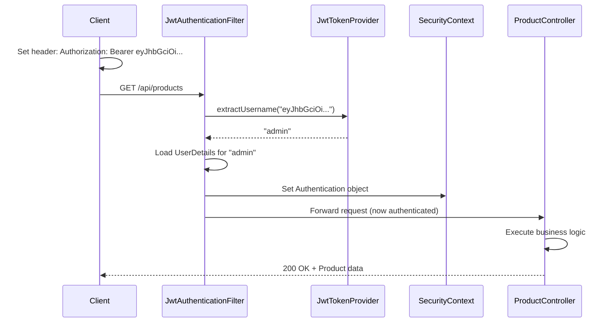

---

## API Endpoints

### Authentication

| Method | Endpoint | Description | Auth |
|--------|----------|-------------|------|
| `POST` | `/api/auth/register` | Register new user | Public |
| `POST` | `/api/auth/login` | Login, get JWT | Public |

### Users

| Method | Endpoint | Description | Auth |
|--------|----------|-------------|------|
| `GET` | `/api/users/me` | Current user info | Any |
| `GET` | `/api/users` | List all users | ADMIN |
| `DELETE` | `/api/users/{id}` | Delete user | ADMIN |

### Products

| Method | Endpoint | Description | Auth |
|--------|----------|-------------|------|
| `POST` | `/api/products` | Create product | ADMIN/MOD |
| `GET` | `/api/products` | List all products | Any |
| `GET` | `/api/products/{id}` | Get product by ID | Any |
| `PUT` | `/api/products/{id}` | Update product | ADMIN/MOD |
| `DELETE` | `/api/products/{id}` | Delete product | ADMIN |
| `GET` | `/api/products/count` | Count products | Any |
| `POST` | `/api/products/bulk` | Bulk create | ADMIN |
| `DELETE` | `/api/products/bulk` | Bulk delete | ADMIN |

### Product Search

| Method | Endpoint | Description |
|--------|----------|-------------|
| `GET` | `/api/products/search?q=` | Full-text search |
| `GET` | `/api/products/search/name/{name}` | Search by name |
| `GET` | `/api/products/search/category/{category}` | Search by category |
| `GET` | `/api/products/search/price?min=&max=` | Price range |
| `GET` | `/api/products/search/fuzzy/{name}` | Fuzzy search |
| `GET` | `/api/products/search/wildcard/{pattern}` | Wildcard search |
| `GET` | `/api/products/search/highlight/{query}` | Search with highlight |
| `GET` | `/api/products/search/bool?name=&minPrice=&maxPrice=` | Bool query |
| `GET` | `/api/products/search/aggregations` | Aggregations |
| `GET` | `/api/products/search/terms-aggregation` | Terms aggregation |
| `GET` | `/api/products/search/category/{cat}/page?page=&size=` | Paginated |
| `GET` | `/api/products/search/sort?category=&sortBy=&direction=` | Sorted |
| `GET` | `/api/products/search/nearby?lat=&lon=&distance=` | Geo nearby |
| `POST` | `/api/products/search/tags` | Search by tags |

### Product Admin

| Method | Endpoint | Description | Auth |
|--------|----------|-------------|------|
| `POST` | `/api/products/admin/index/{name}` | Create index | ADMIN |
| `GET` | `/api/products/admin/index/{name}/exists` | Check index | ADMIN |
| `DELETE` | `/api/products/admin/index/{name}` | Delete index | ADMIN |
| `POST` | `/api/products/admin/index/{name}/refresh` | Refresh index | ADMIN |

### Articles

| Method | Endpoint | Description | Auth |
|--------|----------|-------------|------|
| `POST` | `/api/articles` | Create article | ADMIN/MOD |
| `GET` | `/api/articles` | List all | Any |
| `GET` | `/api/articles/{id}` | Get by ID | Any |
| `PUT` | `/api/articles/{id}` | Update | ADMIN/MOD |
| `DELETE` | `/api/articles/{id}` | Delete | ADMIN |
| `GET` | `/api/articles/count` | Count | Any |
| `GET` | `/api/articles/author/{author}` | By author | Any |
| `POST` | `/api/articles/bulk` | Bulk create | ADMIN |

### Article Search

| Method | Endpoint | Description |
|--------|----------|-------------|
| `GET` | `/api/articles/search/fulltext/{query}` | Full-text search |
| `GET` | `/api/articles/search/title/{query}` | Search by title |
| `GET` | `/api/articles/search/content/{query}` | Search by content |
| `GET` | `/api/articles/search/highlight/{query}` | Highlight search |
| `GET` | `/api/articles/search/paged?q=&page=&size=` | Paginated search |
| `GET` | `/api/articles/search/bool/must?title=&author=` | Bool must |
| `GET` | `/api/articles/search/bool/must-not/{author}` | Bool must-not |
| `GET` | `/api/articles/search/bool/filter` | Terms filter |

### Logs

| Method | Endpoint | Description | Auth |
|--------|----------|-------------|------|
| `POST` | `/api/logs` | Create log | ADMIN/MOD |
| `GET` | `/api/logs` | List all | Any |
| `GET` | `/api/logs/{id}` | Get by ID | Any |
| `DELETE` | `/api/logs/{id}` | Delete | ADMIN |
| `GET` | `/api/logs/level/{level}` | By level | Any |
| `GET` | `/api/logs/service/{service}` | By service | Any |
| `GET` | `/api/logs/errors` | Error responses | Any |
| `GET` | `/api/logs/slow?minDurationMs=` | Slow requests | Any |
| `GET` | `/api/logs/search/{query}` | Search message | Any |
| `GET` | `/api/logs/search/phrase/{phrase}` | Exact phrase | Any |
| `POST` | `/api/logs/bulk` | Bulk create | ADMIN |

### Log Search

| Method | Endpoint | Description |
|--------|----------|-------------|
| `GET` | `/api/logs/search/bool?level=&service=&minResponseCode=` | Bool query |
| `GET` | `/api/logs/aggregations` | Aggregations |
| `GET` | `/api/logs/aggregations/histogram` | Date histogram |

### Locations

| Method | Endpoint | Description | Auth |
|--------|----------|-------------|------|
| `POST` | `/api/locations` | Create location | ADMIN/MOD |
| `GET` | `/api/locations` | List all | Any |
| `GET` | `/api/locations/{id}` | Get by ID | Any |
| `PUT` | `/api/locations/{id}` | Update | ADMIN/MOD |
| `DELETE` | `/api/locations/{id}` | Delete | ADMIN |
| `GET` | `/api/locations/country/{country}` | By country | Any |
| `GET` | `/api/locations/city/{city}` | By city | Any |
| `GET` | `/api/locations/type/{type}` | By type | Any |
| `GET` | `/api/locations/nearby?lat=&lon=&distance=` | Nearby | Any |
| `GET` | `/api/locations/bounding-box?topLat=&topLon=&bottomLat=&bottomLon=` | Bounding box | Any |

### Location Search

| Method | Endpoint | Description |
|--------|----------|-------------|
| `GET` | `/api/locations/search/geo-distance?lat=&lon=&distance=` | Geo distance |
| `GET` | `/api/locations/search/geo-bounding-box?topLat=&topLon=&bottomLat=&bottomLon=` | Geo bounding box |

---

## Elasticsearch Features

### Feature 1: Full-Text Search

Search across multiple text fields using `multi_match`. Elasticsearch analyzes the input (lowercases, tokenizes) and matches against analyzed content.

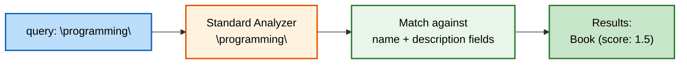

---

### Feature 2: Fuzzy Search

Tolerates typos. Uses `match` query with `fuzziness: AUTO` so "Lapto" matches "Laptop".

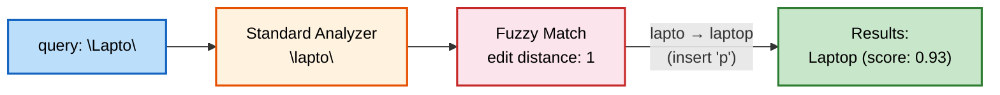

---

### Feature 3: Wildcard Search

Pattern matching on keyword fields. "Pho*" matches "Phone".

```mermaid
flowchart LR
    Q["pattern: \"Pho*\"] --> FIELD["Match against\nname.keyword field"]
    FIELD --> WILDCARD["Wildcard Match\n(Pho → Phone)"]
    WILDCARD --> RESULT["Results:\nPhone"]

    style Q fill:#bbdefb,stroke:#1565c0,stroke-width:2px,color:#000
    style FIELD fill:#fff3e0,stroke:#e65100,stroke-width:2px,color:#000
    style WILDCARD fill:#f3e5f5,stroke:#6a1b9a,stroke-width:2px,color:#000
    style RESULT fill:#c8e6c9,stroke:#2e7d32,stroke-width:2px,color:#000
```

---

### Feature 4: Bool Query

Combine multiple conditions with `must`, `filter`, and `range`.

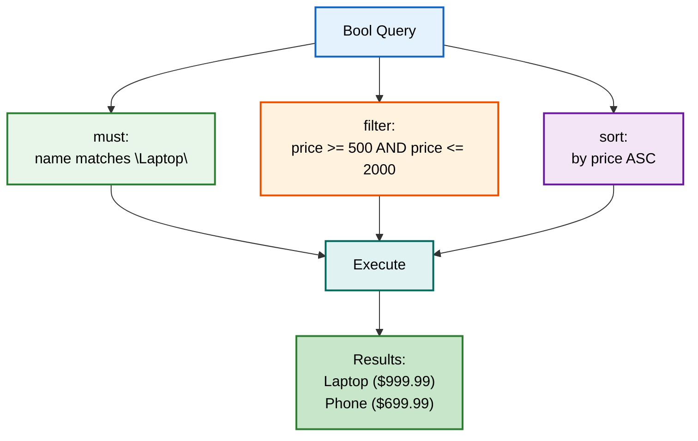

---

### Feature 5: Highlight Search

Returns matching text snippets wrapped in `<em>` tags.

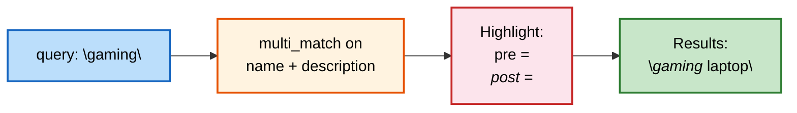

---

### Feature 6: Aggregations

Compute statistics and group data without returning individual documents.

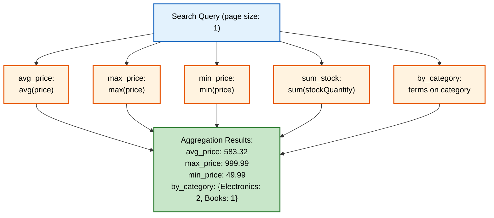

---

### Feature 7: Geo Queries

Find locations by distance or bounding box.

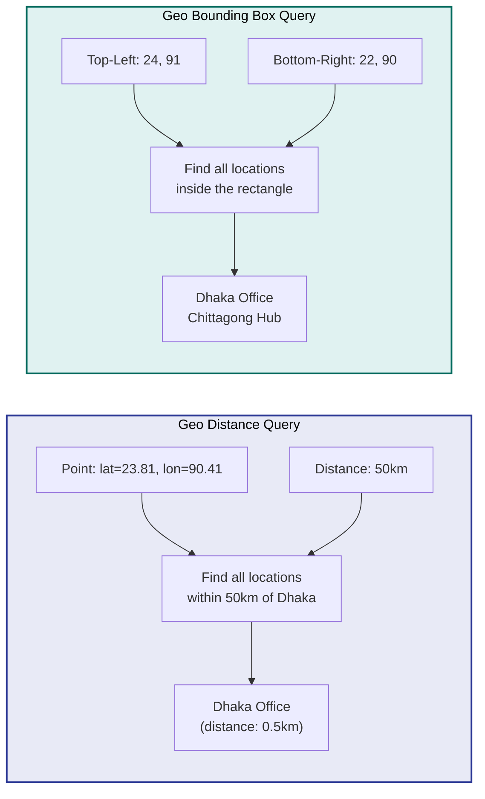

---

### Feature 8: Pagination & Sort

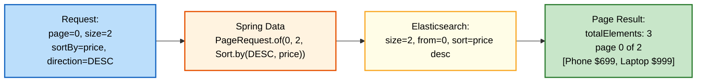

---

## Entity Relationship

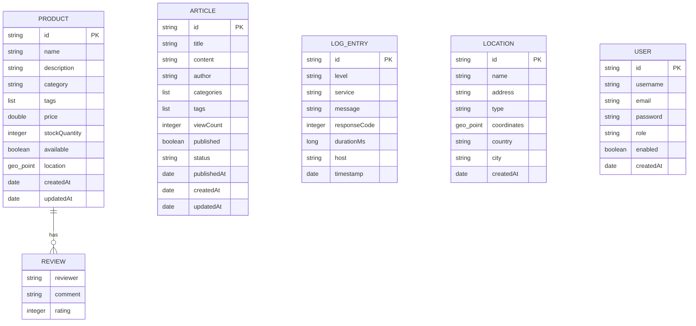

---

## Configuration

### application.yaml

```yaml
spring:
  application:
    name: elastic-search
  elasticsearch:
    uris: http://localhost:9200

server:
  port: 8080

app:
  cors:
    allowed-origins: http://localhost:3000
  jwt:
    secret: 404E635266556A586E3272357538782F413F4428472B4B6250645367566B5970
    expiration-ms: 86400000

management:
  endpoints:
    web:
      exposure:
        include: health,info,beans
```

### Docker Compose

The `docker-compose.yml` runs Elasticsearch 9.4.5 with:
- Single-node discovery
- Security disabled (for development)
- 512MB heap
- Persistent data volume
- Health check on port 9200

---

## Key Implementation Details

### Multi-field Mapping

Product `name` field uses a keyword sub-field for exact matching and wildcard queries:

```java
@MultiField(
    mainField = @Field(type = FieldType.Text, analyzer = "standard"),
    otherFields = @InnerField(suffix = "keyword", type = FieldType.Keyword)
)
private String name;
```

### Fuzzy Search

Uses `match` query with `fuzziness: AUTO` instead of raw `fuzzy` query (which doesn't analyze input):

```json
{ "match": { "name": { "query": "Lapto", "fuzziness": "AUTO" } } }
```

### GeoPoint DTO Pattern

GeoPoint can't be deserialized from JSON directly, so a `LocationRequest` DTO with nested `Coordinates` class handles the conversion:

```java
// Client sends: {"coordinates": {"lat": 23.81, "lon": 90.41}}
// Converted to: new GeoPoint(lat, lon) in controller
```

---

## License

This project is licensed under the MIT License - see the [LICENSE](LICENSE) file for details.
